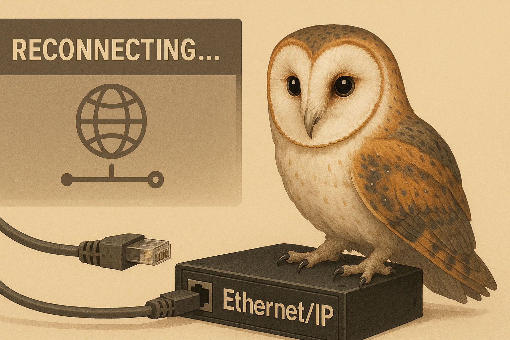

# Handling Disconnects and Reconnections

The standard `goeip.Client` relies on a persistent TCP connection to the PLC. If this connection is severed (e.g., due to network interruptions, PLC power cycle, or timeout), the client enters a failed state where all subsequent operations return errors.

For long-running applications that need to survive network outages, you should use the `ReconnectingClient` wrapper or implement your own reconnection logic.



## Using ReconnectingClient

`goeip` provides a `ReconnectingClient` in the `pkg/client` package. This wrapper automatically detects network errors and attempts to establish a new session transparently.

### Basic Usage

```go
package main

import (
    "log"
    "time"

    "github.com/iceisfun/goeip/pkg/client"
)

func main() {
    // Create a ReconnectingClient
    // By default, it connects immediately and retries 3 times on failure.
    // Set WithMaxRetries(-1) to retry indefinitely.
    rc, err := client.NewReconnectingClient("192.168.1.10", nil, 
        client.WithMaxRetries(5),
        client.WithRetryDelay(2 * time.Second),
    )
    if err != nil {
        log.Fatal(err)
    }
    defer rc.Close()

    // Use rc just like a regular client
    val, err := rc.ReadTag("MyTag")
    if err != nil {
        log.Printf("Read failed after retries: %v", err)
    } else {
        log.Printf("Read success: %v", val)
    }
}
```

### With TagMonitor

`TagMonitor` can also benefit from auto-reconnection. You can pass a `ReconnectingClient` as a custom reader to the monitor.

```go
    // Create ReconnectingClient
    rc, _ := client.NewReconnectingClient("192.168.1.10", logger)

    // Create TagMonitor using the ReconnectingClient
    monitor, err := client.NewTagMonitor(nil, client.WithMonitorReader(rc))
    if err != nil {
        log.Fatal(err)
    }
    
    // Add tags and wait...
```

## Manual Handling

If you prefer to manage connections yourself, you should monitor the errors returned by `ReadTag` or `WriteTag`. If an error indicates a transport failure (e.g., `io.EOF`, `broken pipe`), you must:

1. Close the existing client (`client.Close()`).
2. Create a new client (`client.NewClient(...)`).
3. Retry the operation with the new client.

The `ReconnectingClient` implements this exact pattern for you.
