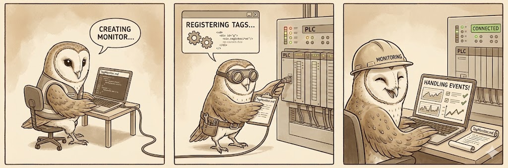

# Tag Monitor

`TagMonitor` is a helper that continuously reads one or more Logix tags and
emits events whenever fresh data is available. The monitor builds on the
existing `client.Client` and keeps the polling logic, rate control, and change
tracking in one place, making it easier to implement state driven scanners.



## Creating a Monitor

```go
logger := internal.NewConsoleLogger()
client, _ := client.NewClient("192.168.1.10:44818", logger)
monitor, _ := client.NewTagMonitor(client)
defer monitor.Close()
```

A monitor exposes a receive-only channel via `monitor.Wait()`. Consumers should
range or select on this channel to react to new snapshots or errors.

```go
for evt := range monitor.Wait() {
    if evt.Err != nil {
        logger.Warnf("failed to refresh %s: %v", evt.Snapshot.Name, evt.Err)
        continue
    }

    var value int32
    _ = evt.Snapshot.Into(&value)

    if evt.Changed {
        fmt.Printf("%s updated -> %d\n", evt.Snapshot.Name, value)
    }
}
```

## Registering Tags

`AddTag` registers a new polling routine. Options configure the behaviour:

- `WithFrequency(d time.Duration)` – set the poll interval (default 500 ms).
- `WithRefreshable(r Refreshable)` – update user state and only emit events when
  `Refresh` reports that the state changed.
- `WithHandler(fn TagHandler)` – invoke a callback every time the tag is read
  successfully.
- `WithInitialRead(true|false)` – enable or disable the immediate read that
  occurs when a subscription is created.

Example:

```go
type Position struct {
    mu  sync.Mutex
    Pos float64
}

func (p *Position) Refresh(snapshot client.TagSnapshot) (bool, error) {
    var value float64
    if err := snapshot.Into(&value); err != nil {
        return false, err
    }

    p.mu.Lock()
    defer p.mu.Unlock()
    if p.Pos == value {
        return false, nil
    }
    p.Pos = value
    return true, nil
}

motor := &Position{}
monitor.AddTag("Motor_Pos", client.WithFrequency(50*time.Millisecond), client.WithRefreshable(motor))
```

`Refreshable` implementations are ideal for state-based applications. They
receive a `TagSnapshot` (which includes the tag name, timestamp, data type, and
raw bytes) and return whether the internal state changed. When `Refresh` returns
`true`, the associated event is marked as `Changed`, allowing downstream code to
filter only the meaningful updates.

The `TagSnapshot.Into` helper unmarshals the payload into any struct or basic
Go type that the `cip` package understands.

## Handling Events

Every subscription sends a `TagEvent` to the monitor's wait channel, even when
only errors occur. `TagEvent` contains the subscription ID, the latest snapshot,
the error (if any), and whether the `Refreshable` signalled a change. The
channel closes when `monitor.Close()` is called, signalling that all
subscriptions have been stopped.

For applications that rely on callbacks instead of the shared channel, use
`WithHandler` to run lightweight logic directly within the subscription goroutine
while still emitting events for other consumers.
