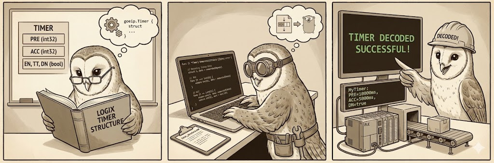

# Logix Timer Structure

This document describes the implementation of Rockwell Logix Timer Structures (TON/TOF/RTO) in `goeip`.



## Overview

Rockwell Logix5000 platforms use a specific memory layout for Timer structures. This library provides a `Timer` struct and a decoder to handle this layout.

## Go Struct

```go
type Timer struct {
    PRE int32  // Preset (ms)
    ACC int32  // Accumulated (ms)
    EN  bool   // Enable
    TT  bool   // Timer Timing
    DN  bool   // Done
}
```

## Binary Layout

The decoder expects the canonical Rockwell memory layout (14 bytes effective, often aligned):

| Offset | Type | Description |
|---|---|---|
| 0-1 | INT | Reserved (ignored) |
| 2-5 | DINT | Status Bits (EN/TT/DN) |
| 6-9 | DINT | PRE |
| 10-13 | DINT | ACC |

### Status Bits

The status DINT packs the flags at the high end:
- Bit 31: EN (Enable)
- Bit 30: TT (Timer Timing)
- Bit 29: DN (Done)

## Usage

You can read a timer tag using the `ReadTimer` method on the `Client`:

```go
client, _ := client.NewClient("192.168.1.10", logger)
timer, err := client.ReadTimer("MyTimer")
if err != nil {
    log.Fatal(err)
}

fmt.Printf("Timer: PRE=%d, ACC=%d, DN=%v\n", timer.PRE, timer.ACC, timer.DN)
```
